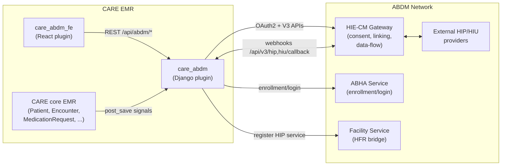
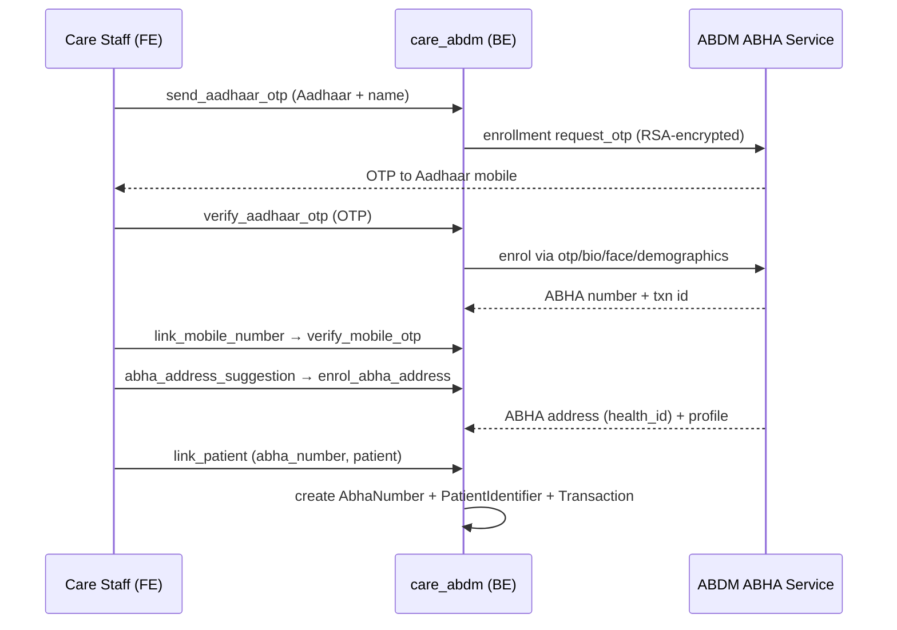
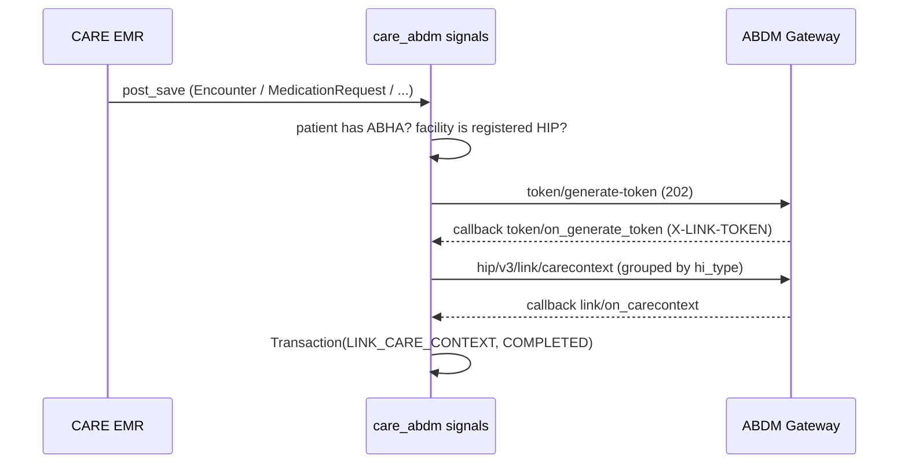
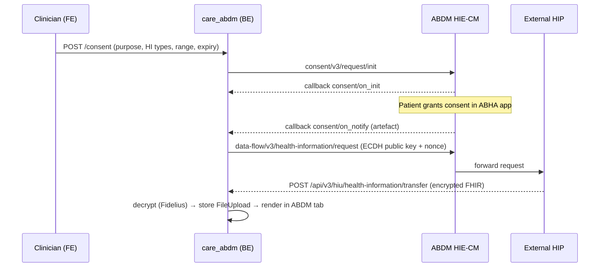

# CARE ABDM Integration — Complete Technical Documentation

> A deep-dive reference covering the ABDM domain, the backend plugin (`care_abdm`,
> Django) and the frontend plugin (`care_abdm_fe`, React/TypeScript), and the
> end-to-end flows that connect CARE to India's national digital health network.

---

## Table of Contents

1. [ABDM Background & Concepts](#1-abdm-background--concepts)
2. [High-Level Architecture](#2-high-level-architecture)
3. [Backend Plugin (`care_abdm`)](#3-backend-plugin-care_abdm)
   - [3.1 App Layout & Bootstrapping](#31-app-layout--bootstrapping)
   - [3.2 Configuration & Settings](#32-configuration--settings)
   - [3.3 Data Models](#33-data-models)
   - [3.4 URL Routing](#34-url-routing)
   - [3.5 API ViewSets](#35-api-viewsets)
   - [3.6 Service Layer (ABDM Gateway V3)](#36-service-layer-abdm-gateway-v3)
   - [3.7 Authentication](#37-authentication)
   - [3.8 Cryptography (Fidelius / ECDH)](#38-cryptography-fidelius--ecdh)
   - [3.9 FHIR Generation](#39-fhir-generation)
   - [3.10 Signals (Auto Care-Context Linking)](#310-signals-auto-care-context-linking)
   - [3.11 Background Tasks](#311-background-tasks)
   - [3.12 Scan & Share Tokens](#312-scan--share-tokens)
   - [3.13 Admin](#313-admin)
4. [Frontend Plugin (`care_abdm_fe`)](#4-frontend-plugin-care_abdm_fe)
   - [4.1 Plugin Registration](#41-plugin-registration)
   - [4.2 Pluggable Components](#42-pluggable-components)
   - [4.3 Feature Components](#43-feature-components)
   - [4.4 API Layer](#44-api-layer)
   - [4.5 Types](#45-types)
   - [4.6 Hooks & Utilities](#46-hooks--utilities)
5. [End-to-End Flows](#5-end-to-end-flows)
6. [Configuration Reference](#6-configuration-reference)
7. [Glossary](#7-glossary)

---

## 1. ABDM Background & Concepts

**ABDM (Ayushman Bharat Digital Mission)** is the Government of India's program to
build the digital backbone of the country's health ecosystem. It defines a set of
federated building blocks and registries that allow patient health records to be
created, discovered, and exchanged across providers with the patient's consent.

### Core building blocks

| Term | Expansion | What it is |
| --- | --- | --- |
| **ABHA Number** | Ayushman Bharat Health Account number | A 14-digit unique health ID for a citizen (displayed as `XX-XXXX-XXXX-XXXX`). The permanent identity anchor. |
| **ABHA Address** | (a.k.a. PHR address / `health_id`) | A human-readable handle like `username@abdm` / `username@sbx`. Used for consent and login. |
| **HIP** | Health Information Provider | An entity that *produces/stores* records (e.g. a hospital running CARE). CARE acts as a HIP. |
| **HIU** | Health Information User | An entity that *requests/consumes* records to provide care. CARE also acts as a HIU. |
| **HIE-CM / CM** | Health Information Exchange & Consent Manager | The ABDM component that brokers consent between patients, HIPs and HIUs. Identified by a **CM ID** (e.g. `sbx`). |
| **HRP / Bridge** | Health Repository Provider / Bridge | The software bridge that registers a facility's HIP/HIU services with the gateway. |
| **HF ID** | Health Facility ID | The unique facility identifier issued by ABDM's Facility Registry (HFR). Required before a facility can act as a HIP. |
| **Care Context** | — | A pointer to a unit of clinical data (an encounter, a prescription, a report) registered against a patient's ABHA so it becomes discoverable/linkable. |
| **Consent Artefact** | — | The cryptographically-signed, granted permission that scopes *what* data, *for whom*, *for how long*, and at what *access mode*. |

### The ABDM gateways CARE talks to

- **ABDM Gateway / HIE-CM** (`ABDM_GATEWAY_URL`, default `https://dev.abdm.gov.in/api/hiecm`)
  — consent, linking, and data-flow orchestration (V3 APIs).
- **ABHA Service** (`ABDM_ABHA_URL`, default `https://abhasbx.abdm.gov.in/abha/api`)
  — ABHA enrollment, login, profile and card.
- **Facility Service / HFR Bridge** (`ABDM_FACILITY_URL`, default `https://facilitysbx.abdm.gov.in`)
  — registering a CARE facility as a HIP/HIU service.

> Defaults point at the **sandbox (SBX)** environment. Production deployments
> override the URLs, `ABDM_CLIENT_ID`/`ABDM_CLIENT_SECRET`, and `ABDM_CM_ID`.

### The two principal exchange patterns

1. **HIP flow (CARE produces data).** When clinical records are created in CARE,
   they are registered as *care contexts* against the patient's ABHA. When another
   provider (HIU) requests them with a valid consent, CARE encrypts the relevant
   FHIR bundles and pushes them to the requester.
2. **HIU flow (CARE consumes data).** A CARE clinician raises a *consent request*
   for a patient's external records. Once the patient grants consent, the
   corresponding HIPs transfer encrypted FHIR bundles to CARE, which decrypts and
   renders them.

### Scan & Share

A patient-facing onboarding shortcut: a facility prints a QR code at its
registration desk. The patient scans it with their ABHA app and shares a profile;
CARE receives a short-lived **token** (a queue token number) that front-desk staff
use to pull up the patient instantly without manual data entry.

---

## 2. High-Level Architecture



- The **frontend** is a pluggable library injected into CARE's UI at well-known
  extension points; it only talks to the backend plugin over `/api/abdm/*`.
- The **backend** is a Django app plugin that exposes model APIs, proxies/wraps the
  ABDM V3 gateway APIs, receives gateway webhooks, and reacts to EMR changes via
  signals.

---

## 3. Backend Plugin (`care_abdm`)

Repository: `care_abdm` · Django app package: `abdm/`

### 3.1 App Layout & Bootstrapping

```
abdm/
├── apps.py            # AppConfig; verbose_name "ABDM Integration"; imports signals on ready()
├── settings.py        # PluginSettings (env / PLUGIN_CONFIGS driven)
├── urls.py            # DRF router with optional-trailing-slash
├── authentication.py  # ABDMAuthentication (validates ABDM-signed JWTs on callbacks)
├── admin.py           # Django admin registrations
├── models/            # AbhaNumber, Consent*, Transaction, HealthFacility, base enums
├── api/               # viewsets (model APIs) + api/v3 (gateway proxy & callbacks)
├── service/           # HTTP client + v3 services (gateway, health_id, facility)
├── utils/             # crypto (fidelius, cipher), fhir/, token helpers
├── signals/           # auto care-context registration on EMR changes
├── tasks/             # Celery tasks (retry failed care contexts)
├── data/              # static data (e.g. state_districts.json)
└── migrations/
```

`apps.py` registers the app under the name **`abdm`** and, on `ready()`, imports
`abdm.signals` so the EMR `post_save`/`pre_save` receivers are wired up.

See [abdm/apps.py](abdm/apps.py).

### 3.2 Configuration & Settings

`abdm/settings.py` defines a `PluginSettings` object that resolves each value in
priority order:

1. `django.conf.settings.PLUGIN_CONFIGS["abdm"]`
2. Environment variable of the same name
3. Hard-coded default

It **validates required settings at startup** and raises `ImproperlyConfigured` if
any are missing/falsy.

**Required settings**

```
ABDM_CLIENT_ID, ABDM_CLIENT_SECRET,
ABDM_GATEWAY_URL, ABDM_ABHA_URL, ABDM_FACILITY_URL,
ABDM_CM_ID, CURRENT_DOMAIN, BACKEND_DOMAIN
```

**Defaults (selected)**

| Setting | Default | Notes |
| --- | --- | --- |
| `ABDM_CLIENT_ID` | `SBX_001` | OAuth2 client/bridge id |
| `ABDM_CLIENT_SECRET` | `xxxx` | OAuth2 secret |
| `ABDM_GATEWAY_URL` | `https://dev.abdm.gov.in/api/hiecm` | HIE-CM gateway |
| `ABDM_ABHA_URL` | `https://abhasbx.abdm.gov.in/abha/api` | ABHA enrollment/login |
| `ABDM_FACILITY_URL` | `https://facilitysbx.abdm.gov.in` | HFR bridge |
| `ABDM_CM_ID` | `sbx` | Consent Manager id |
| `ABDM_USERNAME` | `abdm_user_internal` | system user for callbacks |
| `ABDM_HIP_NAME_PREFIX` / `_SUFFIX` | `""` | decorate HIP display name |
| `ABDM_REQUEST_TIMEOUT` | `30` | seconds |
| `ABDM_ABHA_NUMBER_IDENTIFIER_SYSTEM_SYSTEM` | `https://care.ohc.network/abha_number` | FHIR identifier system |
| `ABDM_SCAN_AND_SHARE_TOKEN_EXPIRY_TIME` | `1800` | 30 min |
| `ABDM_ALLOW_UNVERIFIED_ABHA_ACCOUNT` | `True` | allow linking unverified ABHA |
| `CURRENT_DOMAIN` | `https://care.ohc.network` | frontend domain |
| `BACKEND_DOMAIN` | `https://careapi.ohc.network` | used in callback/push URLs |

A `setting_changed` receiver reloads cached settings when `PLUGIN_CONFIGS` changes
(useful in tests). See [abdm/settings.py](abdm/settings.py).

### 3.3 Data Models

Located in `abdm/models/`.

#### Enums — [abdm/models/base.py](abdm/models/base.py)

- **Status**: `REQUESTED`, `GRANTED`, `DENIED`, `EXPIRED`, `REVOKED` (consent lifecycle).
- **Purpose** (HL7 *PurposeOfUse*): `CAREMGT`, `BTG` (Break-The-Glass / emergency),
  `PUBHLTH`, `HPAYMT`, `DSRCH`, `PATRQT`.
- **HealthInformationType**: `Prescription`, `DiagnosticReport`, `OPConsultation`,
  `DischargeSummary`, `ImmunizationRecord`, `HealthDocumentRecord`, `WellnessRecord`,
  `Invoice`.
- **AccessMode**: `VIEW`, `STORE`, `QUERY`, `STREAM`.
- **FrequencyUnit**: `HOUR`, `DAY`, `WEEK`, `MONTH`, `YEAR` (throttles recurring pulls).

#### `AbhaNumber` — [abdm/models/abha_number.py](abdm/models/abha_number.py)

The patient's ABHA identity stored in CARE.

- Identity: `abha_number`, `health_id` (ABHA address).
- Link: `patient` (OneToOne → `emr.Patient`).
- Demographics: `name`, `first_name`, `middle_name`, `last_name`, `gender`,
  `date_of_birth`, `address`, `district`, `state`, `pincode`, `mobile`, `email`,
  `profile_photo`.
- ABDM OAuth tokens: `access_token`, `refresh_token`.
- `new` flag.
- Property `parsed_date_of_birth()` — tolerates missing month/day by defaulting to `01`.

#### Consent models — [abdm/models/consent.py](abdm/models/consent.py)

- **`Consent` (abstract base)**: `consent_id` (UUID from gateway), `patient_abha`
  (→ `AbhaNumber`), `encounter` (→ `emr.Encounter`), `care_contexts` (JSON, schema
  validated), `status`, `purpose`, `hi_types`, `hip`, `hiu`, `requester`
  (→ `users.User`), `access_mode`, `from_time`/`to_time` (default: 30 days ago → now),
  `expiry` (default +30 days), and frequency fields (`frequency_unit`,
  `frequency_value`, `frequency_repeats`).
- **`ConsentRequest`**: the raised request; exposes a `request_id` property.
- **`ConsentArtefact`**: the granted permission. Adds the **ECDH key material** used
  for encrypting/decrypting transferred data:
  `key_material_algorithm` (`ECDH`), `key_material_curve` (`Curve25519`),
  `key_material_public_key`, `key_material_private_key`, `key_material_nonce`,
  `signature`, plus `cm` (Consent Manager id). Its `save()` override **auto-generates
  a keypair on first save** and **archives associated `FileUpload`s** when the consent
  is revoked/expired.

#### `Transaction` — [abdm/models/transaction.py](abdm/models/transaction.py)

A unified audit log of every ABDM interaction.

- **TransactionType**: `CREATE_OR_LINK_ABHA_NUMBER`, `CREATE_ABHA_ADDRESS`,
  `SCAN_AND_SHARE`, `LINK_CARE_CONTEXT`, `EXCHANGE_DATA`, `ACCESS_DATA`.
- **TransactionStatus**: `INITIATED`, `COMPLETED`, `FAILED`, `CANCELLED`.
- Fields: `reference_id` (request/transaction id), `type`, `status`, `meta_data`
  (JSON payload), `created_by` (→ `users.User`).

#### `HealthFacility` — [abdm/models/health_facility.py](abdm/models/health_facility.py)

Binds a CARE facility to an ABDM HIP.

- `hf_id` (unique ABDM facility id), `registered` (bool), `facility` (OneToOne →
  `facility.Facility`).
- `save()` override: when `hf_id` changes, it updates the pending/failed
  `LINK_CARE_CONTEXT` transactions so they re-link against the new id.

### 3.4 URL Routing

`abdm/urls.py` uses an `OptionalSlashRouter` (trailing slash optional). All routes
are mounted under the plugin prefix (`/api/abdm/`):

**Model routes**

| Route | ViewSet |
| --- | --- |
| `consent` | `ConsentViewSet` |
| `health_information` | `HealthInformationViewSet` |
| `abha_number` | `AbhaNumberViewSet` |
| `health_facility` | `HealthFacilityViewSet` |

**Gateway proxy routes**

| Route | ViewSet |
| --- | --- |
| `v3/health_id` | `HealthIdViewSet` (ABHA enrollment/login/link) |
| `v3/hip` | `HIPViewSet` |
| `v3/hiu` | `HIUViewSet` |
| `v3/utility` | `UtilityViewSet` (states/districts) |

**Callback routes** (consumed by ABDM, secured with `ABDMAuthentication`)

| Route | ViewSet |
| --- | --- |
| `api/v3` (`/api/v3/hip/...`) | `HIPCallbackViewSet` |
| `api/v3` (`/api/v3/hiu/...`) | `HIUCallbackViewSet` |

See [abdm/urls.py](abdm/urls.py).

### 3.5 API ViewSets

#### `AbhaNumberViewSet` — [abdm/api/viewsets/abha_number.py](abdm/api/viewsets/abha_number.py)
- `POST /abha_number` — create an ABHA record; emits a `SCAN_AND_SHARE` transaction.
- `GET /abha_number/{id}` — retrieve by `abha_number`, `health_id`, or `patient_id`.

#### `ConsentViewSet` — [abdm/api/viewsets/consent.py](abdm/api/viewsets/consent.py)
- `POST /consent` — create a consent request via
  `GatewayService.consent__request__init()`.
- `GET /consent` — list consents filtered by the user's facilities and patient.
- Rate-limited (with CAPTCHA fallback).

#### `HealthFacilityViewSet` — [abdm/api/viewsets/health_facility.py](abdm/api/viewsets/health_facility.py)
- `POST /health_facility` — create; async task calls `FacilityService.add_update_service()`.
- `PUT /health_facility/{id}` — update `hf_id`; re-registers if it changed.
- `POST /health_facility/{id}/register_service` — manual registration trigger.

#### `HealthInformationViewSet` — [abdm/api/viewsets/health_information.py](abdm/api/viewsets/health_information.py)
- `GET /health_information/{id}` — return the decrypted FHIR bundle stored against a
  consent artefact's `FileUpload`.

#### `HealthIdViewSet` — [abdm/api/v3/viewsets/health_id.py](abdm/api/v3/viewsets/health_id.py)

ABHA **creation** (proxied to the ABHA service):
`abha_create/verify_aadhaar_bio`, `auth_init_via_face`, `capture_pid_via_face`,
`verify_aadhaar_otp`, `verify_aadhaar_demographics`, `link_mobile_number`,
`enrol_abha_address`.

ABHA **login**: `abha_login/send_otp`, `verify_otp`, `verify_user`,
`check_auth_methods`.

**Linking**: `link_patient` — links an existing ABHA to a CARE patient and creates a
`PatientIdentifier`.

#### `HIPViewSet` & `HIPCallbackViewSet` — [abdm/api/v3/viewsets/hip.py](abdm/api/v3/viewsets/hip.py)

User-facing HIP ops:
- `POST v3/hip/link_care_context` — returns `202` (auto-linked, no manual step).
- `GET v3/hip/patient/fetch-by-token?token=&facility_id=` — resolve a scan-and-share token.

ABDM→CARE webhooks (`HIPCallbackViewSet`, `ABDMAuthentication`):
`token/on_generate_token`, `link/on_carecontext`, `patient/care_context/discover`,
`link/care_context/init`, `link/care_context/confirm`, `consent/request/notify`,
`health_information/request`, `patient/share`.

#### `HIUViewSet` & `HIUCallbackViewSet` — [abdm/api/v3/viewsets/hiu.py](abdm/api/v3/viewsets/hiu.py)

User-facing HIU ops:
- `verify_identity` → `GatewayService.identity__authentication()`.
- `create_consent_request` (delegates to `ConsentViewSet`).
- `consent_request_status`, `fetch_consent_artefact`.

ABDM→CARE webhooks (`HIUCallbackViewSet`, `ABDMAuthentication`):
`consent/on_init`, `consent/on_status`, `consent/on_fetch`, `consent/on_notify`,
`health_information/on_request`, `health_information/transfer` (receives encrypted
data), `patient_share/on_share`.

#### `UtilityViewSet` — [abdm/api/v3/viewsets/utility.py](abdm/api/v3/viewsets/utility.py)
- `GET v3/utility/states` and `.../states/{code}/districts` (from `data/state_districts.json`).

### 3.6 Service Layer (ABDM Gateway V3)

#### HTTP client — [abdm/service/request.py](abdm/service/request.py)

The `Request` class is the single outbound HTTP wrapper:
- **OAuth2 session management** — fetches a token from
  `ABDM_GATEWAY_URL + /gateway/v3/sessions`, caches it with expiry, retries on the
  `900901` "invalid token" error.
- `get()` / `post()` with auto-retry.
- Standard headers on every call: `Content-Type`, `REQUEST-ID` (UUID),
  `TIMESTAMP` (ISO-8601 UTC), `X-CM-ID`. An optional end-user JWT is forwarded as
  `X-Token`.

#### Helpers — [abdm/service/helper.py](abdm/service/helper.py)

- Exceptions: `ABDMAPIException`, `ABDMInternalException` (both HTTP 400).
- `timestamp()`, `uuid()`, `cm_id()`.
- `encrypt_message()` — RSA-OAEP encryption using the ABDM public certificate.
- `validate_and_format_date()`.
- `hf_id_from_encounter()` / `hf_id_from_abha_id()` — resolve the HIP id.
- **Care-context generators** — turn EMR rows into care-context dicts
  (`reference`, `display`, `hi_type`). The reference format is
  `v2::<model>::<id/param>` and is parsed back by
  `care_context_dict_from_reference_id()`:
  - `create_encounter_care_context()`
  - `create_medication_request_care_context()`
  - `create_file_upload_care_context()`
  - `create_questionnaire_response_care_context()`
  - `create_diagnostic_report_care_context()`
  - `create_invoice_care_context()`
  - `generate_care_contexts_for_existing_data(patient, hf_id)` — full back-scan of a
    patient's records.

#### `GatewayService` — [abdm/service/v3/gateway.py](abdm/service/v3/gateway.py)

The largest service (~2k LOC). Key method groups:

- **Token**: `token__generate_token()` — kicks off the link-token handshake (cached
  in Redis, async `202`).
- **Care-context linking**: `link__carecontext()` — groups care contexts by
  `hi_type`, creates a `LINK_CARE_CONTEXT` transaction, and POSTs to
  `/hip/v3/link/carecontext` with the `X-LINK-TOKEN`. User-initiated variants handle
  discover/init/confirm with OTP.
- **Consent**: `consent__request__init()`, `consent__request__status()`,
  `consent__fetch()`, plus the HIP/HIU `on_notify` handlers.
- **Data flow** (the heart of HIE):
  - `data_flow__health_information__request()` — sets up the ECDH keypair + nonce and
    declares the push URL
    `BACKEND_DOMAIN/api/abdm/api/v3/hiu/health-information/transfer`.
  - **`data_flow__health_information__transfer()`** — for each consented care
    context, resolves the EMR row, builds the matching FHIR record via `Fhir()`,
    encrypts it (ECDH + AES-256-GCM), and POSTs to the requester's URL; records an
    `EXCHANGE_DATA` transaction.
  - `..._hip__on_request()`, `..._notify()`.
- **Identity**: `identity__authentication()` — demographic verification for HIU
  consent.
- **Scan & share**: `patient_share__on_share()`.

The mapping used in `data_flow__health_information__transfer()`:

| `reference` model | EMR source | FHIR builder |
| --- | --- | --- |
| `prescription` | `MedicationRequest` | `create_prescription_record()` |
| `encounter` | `Encounter` | `create_op_consult_record()` / `create_discharge_summary_record()` |
| `file_upload` | `FileUpload` | `create_health_document_record()` |
| `questionnaire_response` | `QuestionnaireResponse` | `create_wellness_record()` |
| `diagnostic_report` | `DiagnosticReport` | `create_diagnostic_report_record()` |
| `invoice` | `Invoice` | `create_invoice_record()` |

#### `HealthIdService` — [abdm/service/v3/health_id.py](abdm/service/v3/health_id.py)

Wraps the ABHA service (`ABDM_ABHA_URL/v3`). Aadhaar enrollment (`via_bio`,
`via_demographics`, `via_otp`, `request_otp`), face enrollment (`auth_init__via_face`,
`capturePID__via_face`), `enrol__abha_address`, and login
(`profile__login__request_otp/verify_otp/verify_user`). All sensitive payloads are
RSA-encrypted using the certificate from `/v3/profile/public/certificate`.

#### `FacilityService` — [abdm/service/v3/facility.py](abdm/service/v3/facility.py)

`add_update_service()` registers/updates the facility as a HIP via
`ABDM_FACILITY_URL/v1/bridges/MutipleHRPAddUpdateServices`. The payload carries the
`facilityId` (`hf_id`), the decorated `facilityName` (with prefix/suffix), and an
`HRP` block bound to `ABDM_CLIENT_ID` with `type=HIP`. On success the returned
`hf_id` is persisted on the `HealthFacility`.

### 3.7 Authentication

[abdm/authentication.py](abdm/authentication.py) — `ABDMAuthentication` extends DRF's
`JWTAuthentication`:
- `authenticate()` validates an ABDM-signed JWT on inbound **callback** endpoints.
- `open_id_authenticate()` fetches the gateway's public key from its JWKS endpoint
  and verifies the `RS256` signature.
- `get_user()` resolves/creates the internal system user (`ABDM_USERNAME`,
  default `abdm_user_internal`) so callbacks act under a known principal.

### 3.8 Cryptography (Fidelius / ECDH)

ABDM mandates **end-to-end encryption** of transferred health data using an ECDH key
exchange on **Curve25519**, compatible with the Java *Fidelius/BouncyCastle*
reference.

[abdm/utils/fidelius.py](abdm/utils/fidelius.py):
- `KeyMaterial.generate()` — produces `{private_key, public_key (raw + X509), nonce}`;
  the X509 form includes the BouncyCastle prefix expected by Java peers; the nonce is
  32 random bytes (base64).
- **Encrypt**: XOR the sender & receiver nonces → split into a 12-byte IV + 20-byte
  salt → derive an AES key via HKDF-SHA256 over the ECDH shared secret →
  AES-256-GCM encrypt → base64 of ciphertext+tag.
- `DecryptionRequest` reverses the process with the private key.

[abdm/utils/cipher.py](abdm/utils/cipher.py) — a `Cipher` convenience wrapper around
Fidelius for `ConsentArtefact` key material: `generate_key_pair()`, `encrypt()` →
`{publicKey, data, nonce}`, and `decrypt()`.

### 3.9 FHIR Generation

[abdm/utils/fhir/fhir.py](abdm/utils/fhir/fhir.py) — the `Fhir` class composes
**FHIR R4B** document `Bundle`s per NRCES guidelines. Each builder emits a
`Composition` plus all referenced resources (`Patient`, `Practitioner`,
`Organization`, `Condition`, `Medication`, `Observation`, …) and security metadata
(confidentiality = *Very Restricted*), keyed by the care-context id:

`create_prescription_record`, `create_op_consult_record`,
`create_discharge_summary_record`, `create_health_document_record`,
`create_wellness_record`, `create_diagnostic_report_record`, `create_invoice_record`.

### 3.10 Signals (Auto Care-Context Linking)

[abdm/signals/register_care_contexts.py](abdm/signals/register_care_contexts.py) — the
plugin automatically registers care contexts whenever clinical data is written, so
records become discoverable without manual steps:

| Signal | Model | When |
| --- | --- | --- |
| `post_save` | `MedicationRequest` | prescription created |
| `post_save` | `Encounter` | encounter created |
| `pre_save` | `FileUpload` | upload completes (`upload_completed → True`) |
| `post_save` | `QuestionnaireResponse` | questionnaire filled |
| `post_save` | `DiagnosticReport` | report created |
| `post_save` | `Invoice` | non-draft invoice issued |

Each receiver checks that the patient has an ABHA and the encounter's facility is a
**registered HIP**, then calls `GatewayService.link__carecontext()` inside
`transaction.on_commit()`. Failures are logged (warnings) and never crash the EMR
write path.

### 3.11 Background Tasks

[abdm/tasks/retry_failed_care_contexts.py](abdm/tasks/retry_failed_care_contexts.py):
- `retry_failed_care_contexts()` (`@shared_task`, Celery Beat) — batches
  `LINK_CARE_CONTEXT` transactions in `INITIATED`/`FAILED` state (batch size 500) and
  dispatches `process_care_context_batch.delay()`.
- `process_care_context_batch(ids)` (`queue="care_context_queue"`) — groups by
  `(hf_id, abha_number)`, reconstructs care contexts from `meta_data`, re-calls
  `link__carecontext()`, and marks transactions `CANCELLED` once handled.

### 3.12 Scan & Share Tokens

`abdm/utils/token.py` — `get_or_create_scan_and_share_token(patient, facility)` builds
a `TokenQueue` + `Category` ("ABDM" / "Scan and Share") and issues a token that
expires after `ABDM_SCAN_AND_SHARE_TOKEN_EXPIRY_TIME` (default 30 min).
`get_scan_and_share_token_by_token_number()` resolves it back to a patient at the
front desk.

### 3.13 Admin

[abdm/admin.py](abdm/admin.py) registers `AbhaNumber` (searchable by number/health
id/name/mobile), `ConsentArtefact`, `ConsentRequest`, `Transaction`, and
`HealthFacility`. A non-production-only `delete_abdm_records` action cascade-deletes
ABHA + consent data.

---

## 4. Frontend Plugin (`care_abdm_fe`)

Repository: `care_abdm_fe` · Source: `src/`

A Vite-built React 19 library that plugs into CARE's UI. It only communicates with
the backend over `/api/abdm/*`, using the host app's auth token and API base URL.

Key dependencies: `@tanstack/react-query` (server state), `react-hook-form` + `zod`
(forms/validation), `@radix-ui/*` + shadcn-style UI, `qrcode.react` (QR),
`hi-profiles` (FHIR rendering), `raviger` (routing), `react-i18next` (i18n),
`sonner` (toasts).

### 4.1 Plugin Registration

- [src/index.ts](src/index.ts) — re-exports `manifest` and `routes` to CARE's plugin
  loader.
- [src/manifest.ts](src/manifest.ts) — plugin id **`care_abdm`**. Declares the
  pluggable components injected into the host, and an `abdm` **encounter tab**.
- [src/routes.tsx](src/routes.tsx) — registers the standalone route
  `/abdm/health-information/:id` → `HealthInformation` page.
- [src/config.ts](src/config.ts) — currently empty (no static config).
- Runtime context: `window.__CORE_ENV__.apiUrl` (API base) and
  `__CARE_PLUGIN_RUNTIME__` meta (`faceAuthUrl`, `scanAndShareUrl`,
  `enforceAbhaNumberLinking`). Auth token read from `localStorage.care_access_token`.

### 4.2 Pluggable Components

`src/components/pluggables/` — injected at named CARE extension points:

| Component | Injection point | Purpose |
| --- | --- | --- |
| [PatientHomeActions.tsx](src/components/pluggables/PatientHomeActions.tsx) | `PatientHomeActions` | Button to create/link ABHA when patient has none. |
| [PatientDetailsTabDemographyGeneralInfo.tsx](src/components/pluggables/PatientDetailsTabDemographyGeneralInfo.tsx) | demography tab | ABHA card display + download (PNG/PDF). |
| [EncounterActions.tsx](src/components/pluggables/EncounterActions.tsx) | `EncounterActions` | "Fetch Health Records" → consent request. |
| [FacilityHomeActions.tsx](src/components/pluggables/FacilityHomeActions.tsx) | `FacilityHomeActions` | Configure HF ID + Scan-and-Share QR. |
| [PatientRegistrationForm.tsx](src/components/pluggables/PatientRegistrationForm.tsx) | registration form | Link ABHA and auto-fill demographics. |
| [PatientSearchActions.tsx](src/components/pluggables/PatientSearchActions.tsx) | patient search | Find patient by scan-and-share token. |

### 4.3 Feature Components

- **ABHA linking** — [LinkAbhaNumber/index.tsx](src/components/LinkAbhaNumber/index.tsx)
  wraps the flow in a drawer (`enforceLinking`, `backUrl`, `facilityId`, `onSuccess`).
  [LinkAbhaForm.tsx](src/components/LinkAbhaNumber/LinkAbhaForm.tsx) drives a
  multi-step flow via the `useMultiStepForm` hook:
  - **Create (Aadhaar)**: enter Aadhaar + name + disclaimers → send OTP → verify OTP
    → demographic verification (face / fingerprint via local RD service / manual
    demographics) → link mobile → verify mobile → ABHA-address suggestion → choose
    address → show profile.
  - **Link existing**: enter ABHA/address/mobile → check auth methods → send OTP →
    verify OTP → choose account → verify user → show profile.
  - [ShowAbhaProfile.tsx](src/components/LinkAbhaNumber/ShowAbhaProfile.tsx) renders
    the resulting ABHA card with download options.
- **Consent** — [CreateConsentRequestForm.tsx](src/components/CreateConsentRequestForm.tsx):
  purpose, date range, HI-types (multi-select), expiry; Zod-validated; POSTs to
  `/api/abdm/consent/`.
- **Facility** — [ConfigureHealthFacilityForm.tsx](src/components/ConfigureHealthFacilityForm.tsx)
  (enter/update HF ID, show registration status) and
  [GenerateScanAndShareQR.tsx](src/components/GenerateScanAndShareQR.tsx) (per-counter
  QR pointing at `scanAndShareUrl?hf=<HF_ID>&counter=<n>`, downloadable as SVG).
- **Token search** — [TokenSearchDialog.tsx](src/components/TokenSearchDialog.tsx):
  debounced 6-digit token lookup → patient card.
- **Encounter tab** — [encounter-tabs/Abdm.tsx](src/components/encounter-tabs/Abdm.tsx):
  lists consent requests + granted artefacts; refresh to poll status; click an
  artefact to view records.
- **Health records page** — [pages/HealthInformation.tsx](src/components/pages/HealthInformation.tsx):
  fetches and renders FHIR bundles with `hi-profiles`; handles loading, archived,
  and error states.
- **UI primitives** — `src/components/ui/` (shadcn-style: Button, Dialog, Drawer,
  Form, InputOTP, MultiSelect, Calendar, etc.).

### 4.4 API Layer

`src/apis/` — typed clients over the backend:

- [request.ts](src/apis/request.ts) — generic `request<T>()`; attaches the Bearer
  token, uses `window.__CORE_ENV__.apiUrl`, custom `APIError`, handles JSON +
  `image/png`.
- [index.ts](src/apis/index.ts) — grouped clients:
  - `consent` — `list`, `create`, `get`, `checkStatus` (→ `/v3/hiu/consent_request_status/`).
  - `healthInformation` — `get(artefactId)`.
  - `healthFacility` — `list`, `create`, `get`, `update`, `partialUpdate`,
    `registerAsService`.
  - `abhaNumber` — `get`, `create`.
  - `healthId` — ABHA create (Aadhaar OTP/bio/face/demographics), mobile linking,
    address suggestion/enrol, `linkAbhaNumberAndPatient`, login
    (`check_auth_methods`/`send_otp`/`verify_otp`/`verify_user`), `getAbhaCard`.
  - `utility` — `states`, `districts`.
  - `hip` — `getPatientByToken`.
  - `rdService` — `capture()` against the local biometric device at
    `https://127.0.0.1:11100/rd/capture`.
  - `user`, `govtOrganization` — host-app helpers for current user and geo lookup.

### 4.5 Types

`src/types/` mirrors the backend: `abhaNumber.ts` (`AbhaNumber`,
`AbhaLoginAccount`), `consent.ts` (purpose/status/HI-type/access-mode/frequency
unions + `Consent`/`ConsentRequest`/`ConsentArtefact`), `healthFacility.ts`,
`healthInformation.ts`, `meta.ts` (`MetaConfig`, `WithMeta<T>`), plus thin wrappers
for patient/facility/encounter/user/govtOrganization.

### 4.6 Hooks & Utilities

- [hooks/useDebouncedState.ts](src/hooks/useDebouncedState.ts) — debounce for token
  search.
- [hooks/useMessageListener.ts](src/hooks/useMessageListener.ts) — service-worker
  messages.
- [LinkAbhaNumber/useMultiStepForm.tsx](src/components/LinkAbhaNumber/useMultiStepForm.tsx)
  — step state machine with a shared `memory` object and `goTo()`.
- `lib/` — `utils.ts` (`cn`, toast helpers), `constants.ts`
  (`MAX_OTP_RESEND_COUNT=3`, `SUPPORTED_AUTH_METHODS=["AADHAAR_OTP","MOBILE_OTP"]`,
  `I18NNAMESPACE="care_abdm_fe"`), `dayjs.ts` (configured plugins).

---

## 5. End-to-End Flows

### 5.1 ABHA creation (Aadhaar) and patient linking



### 5.2 Automatic care-context linking (CARE as HIP)



### 5.3 Consent + health-information exchange (CARE as HIU)



When CARE is the HIP being asked (5.2 inverse), the
`data_flow__health_information__transfer()` path builds FHIR bundles from the EMR,
encrypts them with ECDH+AES-256-GCM, and pushes them to the requester.

### 5.4 Scan & Share

```
Facility configures HF ID → generates per-counter QR (scanAndShareUrl?hf=&counter=)
   → patient scans with ABHA app → ABDM posts share → BE issues queue token
   → front desk uses TokenSearchDialog (6-digit token) → patient resolved instantly.
```

---

## 6. Configuration Reference

### Backend `PLUGIN_CONFIGS["abdm"]` / environment

| Key | Required | Default | Description |
| --- | --- | --- | --- |
| `ABDM_CLIENT_ID` | ✅ | `SBX_001` | OAuth2/bridge client id |
| `ABDM_CLIENT_SECRET` | ✅ | `xxxx` | OAuth2 secret |
| `ABDM_GATEWAY_URL` | ✅ | `https://dev.abdm.gov.in/api/hiecm` | HIE-CM gateway |
| `ABDM_ABHA_URL` | ✅ | `https://abhasbx.abdm.gov.in/abha/api` | ABHA service |
| `ABDM_FACILITY_URL` | ✅ | `https://facilitysbx.abdm.gov.in` | HFR bridge |
| `ABDM_CM_ID` | ✅ | `sbx` | Consent Manager id |
| `CURRENT_DOMAIN` | ✅ | `https://care.ohc.network` | frontend domain |
| `BACKEND_DOMAIN` | ✅ | `https://careapi.ohc.network` | callback/push base |
| `ABDM_AUTH_URL` | — | `""` | optional auth url |
| `ABDM_USERNAME` | — | `abdm_user_internal` | callback system user |
| `ABDM_HIP_NAME_PREFIX` / `_SUFFIX` | — | `""` | HIP display name decoration |
| `ABDM_REQUEST_TIMEOUT` | — | `30` | request timeout (s) |
| `ABDM_SCAN_AND_SHARE_TOKEN_EXPIRY_TIME` | — | `1800` | token TTL (s) |
| `ABDM_ALLOW_UNVERIFIED_ABHA_ACCOUNT` | — | `True` | allow unverified ABHA linking |
| `ABDM_ABHA_NUMBER_IDENTIFIER_SYSTEM_SYSTEM` | — | `https://care.ohc.network/abha_number` | FHIR identifier system |

### Frontend runtime meta (`__CARE_PLUGIN_RUNTIME__` / `MetaConfig`)

| Key | Description |
| --- | --- |
| `enforceAbhaNumberLinking` | Force ABHA linking before proceeding |
| `scanAndShareUrl` | Base URL embedded in Scan-and-Share QR |
| `faceAuthUrl` | Face-auth helper URL for ABHA creation |

---

## 7. Glossary

- **ABHA Number** — 14-digit permanent health id.
- **ABHA Address (`health_id`)** — `name@cm` handle for consent/login.
- **HIP / HIU** — provider of / user of health information. CARE is both.
- **HIE-CM / CM** — consent broker; `ABDM_CM_ID` (e.g. `sbx`).
- **HF ID** — ABDM facility id; prerequisite for HIP operation.
- **Care Context** — discoverable pointer to a clinical record (`v2::model::id`).
- **Consent Artefact** — signed, scoped grant with ECDH key material.
- **Fidelius** — ABDM's reference ECDH(Curve25519)+AES-256-GCM crypto scheme.
- **Scan & Share** — QR-based token onboarding at the registration desk.
- **RD Service** — local Registered Device (port 11100) for biometric capture.
